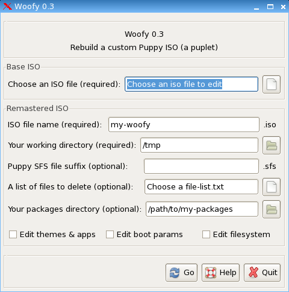

# Woofy

A simple remaster tool for [Puppy Linux](http://puppylinux.com).

- With Woofy, you can customise and rebuild an ISO file, without having to boot it up.
- Just choose your 'base' ISO - the ISO you want to remaster.

Puppy Linux Forum thread: http://www.murga-linux.com/puppy/viewtopic.php?t=57037

Thanks to stu90, iguleder, jemimah, 01micko, shinobar, others...

## Requirements

This program only works on Puppy Linux.

### Dependencies

- [gtkdialog](https://github.com/01micko/gtkdialog/) >= 0.8.4 (for the GUI)
- [gtkdialog-splash](https://github.com/puppylinux-woof-CE/woof-CE/blob/22c86bec679d267eef7bce1ea317739e992bc14d/woof-code/rootfs-skeleton/usr/bin/gtkdialog-splash) (a script)
- [squashFS](https://github.com/plougher/squashfs-tools) (to pack/unpack SFS files)
- Xdialog
- ROX-filer
- mkisofs
- rxvt
- lzmadec
- undeb
- unrpm
- tar
- xzdec

Note: Most of these, if not all, are usually included in Puppy Linux by default.

## Download

- [Woofy 0.91](http://www.murga-linux.com/puppy/viewtopic.php?mode=attach&id=57622)

## Screenshots

### Main menu



## Features

- Woofy can remaster any Puppy Linux ISO, using any version of Puppy Linux.
- add packages, remove files, edit themes, edit initrd.gz,
- choose to remaster with or without a zdrv
- check for missing dependencies in your new ISO
- supports grub or isolinux
- supports jwm, gtk, openbox and icon themes
- allows manual edit of SFS and ISO before building the final product

Video Demo: http://www.youtube.com/watch?v=cpMk7frOEho

## Usage

Use the menu entry, found at `Menu->System->Woofy`.

Or type `woofy` in the terminal to see all the logging output, as your new ISO file is created.

Once the Woofy UI has loaded:

1. Select the ISO you want to remaster
2. Choose a name for your new ISO file
3. Choose a working dir (a linux partition with lots of space, choose /tmp to use your RAM)
4. Choose a suffix for your sfs file (optional, must not contain spaces)
5. Add a text file, listing all files to be deleted from the iso (must contain full paths)
6. Choose a directory, containing the packages to add (supports pet, sfs, tar.gz, deb, rpm, txz, xz)
7. Choose to edit defaults apps, themes, sfs and boot options (or not)
8. Click 'Go', follow the on screen instructions.

## Building your own package

In Puppy Linux, run the following command from the root directory of this repo:

```shell
dir2pet woofy-0.91
```

This will build the PET package for you.

## System Requirements

You need a Puppy Linux ISO file to remaster, any version since 2009 should do.

You can use Woofy on any Puppy Linux, full install or frugal, save file or no save file.
If you have a Linux partition, or a large save file (400mb+ free space), you do not even need much RAM.

The only real requirement is that you have enough space in your chosen working directory
(which could be your RAM, a save file, or a mounted linux partition)

"Enough space" means 3 or 4 times more than your ISO file size.

If remastering a Puppy ISO with a different SFS version than the one running Woofy,
you must have both mksquashfs3 and mksquashfs4 installed to remaster successfully.

## Changelog

version 0.91

- new method for deleting files, choose apps to remove from Xdialog checklist
- files woofy_missing_libs.txt and woofy_deleted_files.txt saved to $WORKDIR
- reverted Xdialog progress bars for SFS creation to normal rxvt window (faster)

version 0.9

- fixed: duplicate and old listings in gtk, jwm, openbox, icon themes
- fixed: general code cleanup and fixes, improved logic
- fixed: creation of zdrv for other kernels
- fixed: initrd-editor.sh for unsupported files
- fixed: handling of installing SFS addon packages
- fixed: required to run as root, asks for root passwd if not root
- fixed: improved terminal output, easier to understand
- fixed: theme GUIs fixed for Pups with no ROX
- added: change default window manager of ISO, with wmswitcher
- added: offer to check deps, list missing libs in new SFS (thanks jemimah)
- added: GUI progress bars when building the SFS files (thanks jemimah)
- added: GUI dialogs for pkg install and ISO creation
- updated: re-organized pkg; fewer deps, all moved to /usr/local/woofy
- updated: woofy auto-update in ISO synced with new pkg format
- updated: remove initrd-editor and defaults-chooser auto-update in ISO
- updated: defaults-chooser, supports more apps
- updated: Help GUI has lots more info than before
- removed all binaries from the pkg (they should be in your pup!)
- woofy pkg now only 25k

version 0.8

- fixed: update of defaults-chooser and initrd-editor.sh in new ISO
- fixed: always check for full paths in list of files to delete
- fixed: get kernel version from base ISO, user must enter it manually if not found
- fixed: better detection and support of zdrvs in the base ISO
- fixed: remove zdrv on remastered ISO, if added back into main SFS
- fixed: creation of png icons, when updating icons theme
- fixed: wallpaper only updated if supplied image exists
- updated: improvement of terminal messages given during remaster

version 0.7

- new: option to edit initrd.gz, when setting boot options
- new: auto update initrd-editor in remastered ISO, if it's already installed
- new: auto update defaults-chooser in remastered ISO, if it's already installed
- new: added openbox themes support
- new: icon creation, now scales/converts SVG and 24x24 icons, if needed (like icon_switcher)
- new: choose desktop icon layout setup, with smart choice of "default" icon layout for different pups
- fixed: supports all new puppy sfs names, even from latest woof
- fixed: chooses correct zdrv file name for all puppies, even latest from woof
- fixed copying of icon themes into default theme folder on ISO
- fixed: improved automatic deletion of supplied list of files on ISO
- updated: defaults-changer (built in to woofy) updated to 0.8
- updated: better GUI layout and boot settings GUI logic, nicer timing and info on tooltips and help dialogs
- updated: help info screen, more up to date with all features
- updated: sfsver comparison for zdrv naming, puplets fix
- updated: better comments in main script
- Known issues with latest (0.7): here

version 0.6

- new: remaster lupu, luci, lupq, quirky, wary, dpup, tpup, spup (etc), puppy4, puppy3 and puppy2
- new: remaster any puppy version, not only the one which is booted
- new: editable boot options for both grub4dos and isolinux booting ISOs
- new: creates joliet iso file with a nice volume name
- new: supports remaster of isos with either sfs3 or sfs4
- new: option to create or remove zdrv sfs for the new live cd
- new: supports remaster of isos with multiple sfs files
- new: auto-update woofy, if installed on the chosen iso
- new: option to delete any working dirs during remaster process that are no longer required (save space)
- new: option to manually edit iso files before building the new iso file (to edit splash.xpm, etc)
- fixed: many, many bugfixes, plus very reliable error-handling at each step
- fixed: runs cleanup and exits whenever any step of the remaster fails
- faster, safer

...

version 0.3

- change the default apps, wallpaper and gtk/jwm/icon themes
- (slightly) better help info, dialogs and tooltips
- (thanks to lguleder for many changes..)

version 0.2

- choose to edit sfs and boot options before remaster
- added help GUI when editing boot params
- rename sfs file to use the chosen suffix
- better tooltips in gui fields
- pinstall is executed in the new sfs, for each pet added (thanks to lguleder)
- fixmenus is executed on the sfs before its created (thanks to lguleder)
- fixmenus added to first boot stuff in new rc.update file (thanks to jemimah)
- better start and finish dialogs

## Contributing:

1. Fork this repo.

2. Then pull down the code:

```shell
git clone https://github.com/<username>/woofy
cd woofy
```

2. Edit some files.

3. Rebuild the PET package (see `Building your own package` above)

4. Install the package (click on it or run `petget <package>.pet`).

5. Test out your changes.

6. Share your changes:

Push your changes to your fork:

```shell
git checkout -b "mybranch"
git add .
git commit -m "some message"
git push -u origin mybranch
```

Then open a Pull Request.
